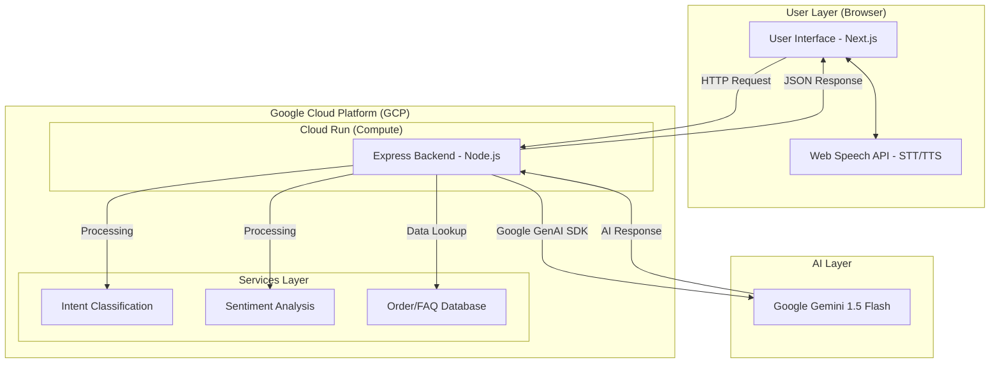

# AI Customer Support Agent - Architecture Diagram

### Flow Explanation for Judges:
1. **Input**: User speaks into the microphone (Next.js + Web Speech API).
2. **Processing**: Request hits the **GCP Cloud Run** hosted Express server.
3. **Intelligence**: Backend leverages the **Google Generative AI SDK** to connect with **Gemini 1.5 Flash**.
4. **Context**: Backend enriches the prompt with real-time order data and FAQ context before sending it to Gemini.
5. **Output**: Gemini's response is sent back to the frontend and spoken aloud to the user.
